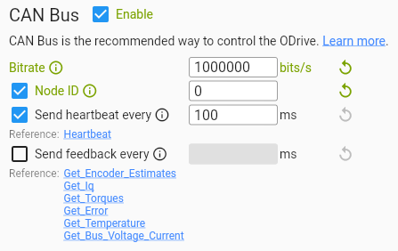

# odrive_ros2_control_example
This repository contains multiple key components to control one or multiple [ODrive Motor Controllers](https://odriverobotics.com) using ros2_control.

- **`odrive_hardware_interface`**: [ros2_control hardware_interface](https://control.ros.org/rolling/doc/ros2_control/hardware_interface/doc/hardware_components_userdoc.html) for real-time communcation with the odrive using CAN bus → [More info](hardware/README.md)
- **`odrive_controller`**: [ros2_control controller](https://control.ros.org/rolling/doc/ros2_controllers/doc/controllers_index.html#ros2-controllers) to send control commands to hardware_interface. Can compute commands using chained pid controller or pass values directly to odrive.
   → [More info](odrive_ros2_control/README.md)
- **`example configuration`**: Launch, config and urdf files as an example for using the `odrive_hardware_interface` and `odrive_controller`.

# Background
## Disclaimer
Much of the code in this repository is copied from this [official ODrive repository](https://github.com/odriverobotics/ros_odrive/tree/main). I added some additional features and refined some other aspects.

The code is **NOT** extensivly tested -> **BE CAUTIOUS!**
## Why ros2_control?
The ros2_control is a framework for (real-time) control of robots using ros2. It enables standardized, modular robot control, code reuse (like controllers and hardware interfaces), real-time performance, and is just a great library that is widely used in the ros2 community.
## Features
### ODriveHardwareInterface
- Communicates with odrive(s) over Linux SocketCAN
- Configuration of common values:
    - motor_velocity_limit
    - motor_current_limit
    - position_p_gain
    - velocity_p_gain
    - velocity_i_gain
    - input_filter_bandwith
    - trajectory_vel_limit
    - trajectory_accel_limit
    - trajectory_descel_limit
    - trajectory_inertia
- Position, velocity and torque Feedback
- Multiple Control Modes: 
    - position_filtered 
    - position_trajectory
    - velocity_ramped
    - torque_control
### ODriveController
- can passthrough values directly to hardware interface
- has a uses a chained pid_controller: 
    - position_input->**position_pid**->**velocity_pid**->torque_output
    - mimics the same control structure used by the odrive internally (see [here](https://docs.odriverobotics.com/v/latest/manual/control.html#structure))
- configures hardware interface mode

### TODO
- Interpret Error Codes
- Other telemetry: Additional data like temperatures, DC voltage, etc. are currently not propagated through ros2_control up to the application
- change control_mode on the fly
- change parameters like pid gains on the fly
- Implement all other control modes provided by the odrive

## Hardware
The code in this repository was developed and tested on a [Raspberry Pi 5 16gb](https://www.raspberrypi.com/products/raspberry-pi-5/).

The [ODrive S1](https://shop.odriverobotics.com/products/odrive-s1) and was connected to a [T-Motor U8II KV85 Motor](https://store.tmotor.com/product/u8-v2-u-efficiency-kv85.html). 

The CAN bus is used through a [USB-CAN Adapter](https://shop.odriverobotics.com/products/usb-can-adapter) from ODrive.

## Real-Time Capabilites
To take full advantes of the ros2_control library you should run this program on a real-time capable version of linux. In my case I used this [Raspberry Pi Image](https://github.com/ros-realtime/ros-realtime-rpi4-image) with ros2 and the real-time kernel.

Follow instructions [here](https://control.ros.org/rolling/doc/ros2_control/controller_manager/doc/userdoc.html#determinism) to configure ros2_control to take advantage of a real-time capable linux distro.

# ODrive Configuration
Nothing specifically has to be configured besides the CAN bus bitrate, node_id and hearbeat.


# Installation
This repository is supposed to be cloned into the `src` folder of a ros2 workspace. If you dont already have one, create it like this:
```sh
mkdir -p ros2_ws/src
```
Clone the repository:
```sh
cd ros2_ws/src && git clone https://github.com/alexmnr/odrive_ros2_control_example.git
```

## Install Dependencies
This project uses [rosdep](https://docs.ros.org/en/jazzy/Tutorials/Intermediate/Rosdep.html) to install dependencies. Follow the instructions [here](https://docs.ros.org/en/humble/Tutorials/Intermediate/Rosdep.html#rosdep-installation) to install it. Then run:
```sh
cd ros2_ws && rosdep install --from-paths src -y --ignore-src
```

## Build 
All command are supposed to be run from within the `ros2_ws` folder (or however your workspace is called).

Build all:
```sh
colcon build
```
Source Repository:
```sh
source install/local_setup.sh
```

# Usage
You can use this repository directly or use the code as a template. I tried my best in leaving comments so that code is easily reusable and extendible.

## Configuration
There is 2 main configuration files that control the behaviour of the hardware interface and controller itself, these are located in the `config` folder.

### *`robot.ros2_control.xacro`*: Hardware Interface Configuration
Hardware Parameters:
```xml
<hardware>
    <plugin>odrive_hardware_interface/ODriveHardwareInterface</plugin>
    <!-- Name of can interface to use -->
    <param name="can_interface_name">can0</param>
</hardware>
```
Individual Joint Configuration:
```xml
<joint name="arm">
    <!-- Required Motor Parameters -->
    <param name="can_id">0</param>

    <!-- Optional Motor Parameters (remove lines if parameters should not be changed or set to 0 if value is supposed to be infinite (only applicable to certain parameters)) -->
    <param name="motor_velocity_limit">10</param> 
    <param name="motor_current_limit">15</param>
    <param name="position_p_gain">30</param>
    <param name="velocity_p_gain">0.2</param>
    <param name="velocity_i_gain">4.0</param>
    <param name="input_filter_bandwith">1000</param>
    <param name="trajectory_vel_limit">10</param>
    <param name="trajectory_accel_limit">8</param>
    <param name="trajectory_descel_limit">8</param>
    <param name="trajectory_inertia">0</param>

    <!-- Command Interfaces -->
    <command_interface name="position" data_type="double"/>
    <command_interface name="velocity" data_type="double"/>
    <command_interface name="effort" data_type="double"/>

    <!-- 
        Mode (the odrive_controller sets this automatically, change only if using another controller)
        0 - idle (default)
        1 - position_filtered
        2 - position_trajectory
        3 - velocity_ramped
        4 - torque_control
    -->
    <command_interface name="mode" data_type="double">
        <param name="initial_value">0</param>
    </command_interface>

    <!-- State Interfaces -->
    <state_interface name="position" data_type="double"/>
    <state_interface name="velocity" data_type="double"/>
    <state_interface name="effort" data_type="double"/>
</joint>
```
### *`robot_controllers.yaml`*: Controller Configuration
```yaml
controller_manager:
  ros__parameters:
    update_rate: 1000  # Update rate in Hz

    # Joint State Broadcaster (no configuration needed)
    joint_state_broadcaster:
      type: joint_state_broadcaster/JointStateBroadcaster

    # Custom Odrive Controller 
    odrive_controller:
      type: odrive_controller/ODriveController

odrive_controller:
  ros__parameters:
    # Joints: specify names of joints to be controlled
    joints:
      - arm

    # Passthrough [true, false]: if true, all values send will be directly passed to the hardware. Use this if the odrive itself is handling all control.
    passthrough: false
    # Mode [idle, position_filterd, position_trajectory, velocity_ramped, torque_control]: If passthrough is used, specify which mode to configure the odrive to.
    mode: torque_control

    # Gains for position and velocity pid controllers
    gains:
      arm: {
        "position_p": 30.0, "position_i": 0.0, "position_d": 0.0, "position_output_min:": -10.0, "position_output_max:": 10.0,
        "velocity_p": 0.2, "velocity_i": 4.0, "velocity_d": 0.0, "velocity_output_min:": -.inf, "velocity_output_max:": .inf,
      }
```

## Adaptation to Custom Robot
If you just want to control one motor, this project by itself will do fine. However you most likely want to create a more complex system then that.

In this case, one should create a custom urdf for their robot. You can use `description/urdf/robot.urdf.xacro` as an example.

Furthermore, the launch file provided in `launch/robot.launch.py` is more of an example and should be extended with your own configuration and additional nodes.

## Connect ODrive
Connect the CAN bus adapter to the ODrive(s) and to the device running this code. 
Run:
```sh
sudo ip link set up can0 type can bitrate 1000000
```

## Build and Run
From the `ros2_ws` folder:
```sh
colcon build --packages-select odrive_ros2_control_example && ros2 launch odrive_ros2_control_example robot.launch.py
```
To filter the output for only the important stuff:
```sh
colcon build --packages-select odrive_ros2_control_example && ros2 launch odrive_ros2_control_example robot.launch.py | grep -e 'ODriveHardwareInterface' -e 'ODriveController' -e 'ERROR' -e 'WARN'
```

## Sending Commands
The ODriveController receives its commands on the `/odrive_controller/command` topic that has type `control_msgs/msg/DynamicJointState`.

Simply implement a publisher that publishes a message of the following structure:
```yaml
header:
  stamp:
    sec: 1767068926
    nanosec: 214278888
  frame_id: ''

joint_names:
- arm
- jointX

# if passthrough = false (using pid controller on the local device)
interface_values:
- interface_names:
  - position # has to be position 
  values:
  - 9.0 # Goal position in [rad]
- interface_names:
  - position 
  values:
  - -10.0 

# if passthrough = true (using odrive controller [position_filtered, position_trajectory, velocity_ramped, torque_control])
interface_values:
- interface_names:
  - position
  - velocity
  - effort
  values:
  - 9.0
  - 1.0
  - 5.0
```
## Example Command Sender
There are two c++ nodes give in this project that implement the publisher mentioned above:
- `testing/odrive_controller_value_publisher.cpp`: publishes a single value
Examples:
```sh
ros2 run odrive_ros2_control_example odrive_controller_value_publisher --ros-args -p interface:=position -p joint:=arm -p frequency:=1.0 -p value:=10.00
```
```sh
ros2 run odrive_ros2_control_example odrive_controller_value_publisher --ros-args -p interface:=velocity -p joint:=jointX -p frequency:=0.0 -p value:=-10.00
```
```sh
ros2 run odrive_ros2_control_example odrive_controller_value_publisher --ros-args -p value:=-10.00
```
- `testing/odrive_controller_sin_publisher.cpp`: publishes a sin wave
Examples:
```sh
ros2 run odrive_ros2_control_example odrive_controller_sin_publisher --ros-args -p period:=4.0 -p amplitude:=10.0 -p joint:=arm
```
```sh
ros2 run odrive_ros2_control_example odrive_controller_sin_publisher
```

# Visualisation and Debugging
The output of ros2 itself can be quite useful, you can show more using the following argument:
```sh
ros2 launch odrive_ros2_control_example robot.launch.py log:='info'
```

There is a handfull of topics that publish useful information:
- `/controller_manager/introspection_data/full`
- `/joint_states`
- `/odrive_controller/command`

## FoxGlove
Foxglove Studio (download [here](https://foxglove.dev/download?utm_term=&hsa_grp=&hsa_ad=&hsa_tgt=&hsa_kw=&hsa_mt=&gad_campaignid=23056616386) or use in browser [here](https://app.foxglove.dev/alexander-minor-1/dashboard)) is a great software to visualize and plot important values in ros2 projects.

To use foxglove in this project, run the following command in a seperate terminal:
```sh
ros2 run foxglove_bridge foxglove_bridge
```
Now open foxglove studio and open a connection to the device running the code. From the top right corner click on **Import from File** and choose `assets/foxglove_config.json` from this repository. It should look something like this (note that the motor is experiencing a lot of resistence in this example):


